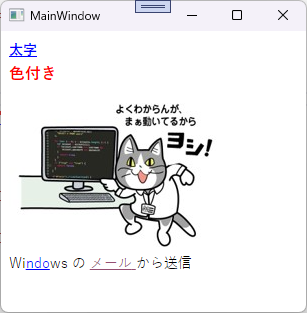
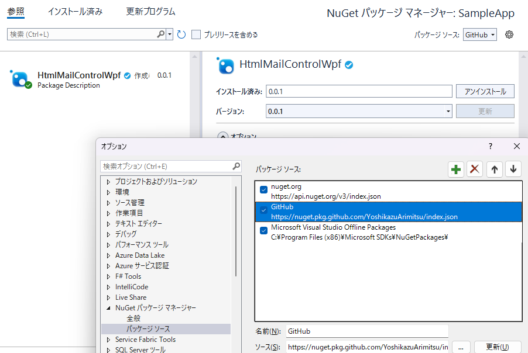

# HtmlMailViewerWpf

## 概要



HTML 形式のデータを持つ Email ファイル(.eml) を内部で展開し、WebView2 に表示する WPF 用コントロールです。

また、文字列パターンを指定する事で本文中のマッチした部分をリンクに差し替え、リンクをクリックした時にアプリケーション側でイベントを受け取る事が可能です。

## 利用方法

[SampleApp](./SampleApp/) が実際の使用例です。

```xml
<Window x:Class="SampleApp.MainWindow"
        ...
        xmlns:hmv="clr-namespace:HtmlMailControlWpf;assembly=HtmlMailControlWpf">
    <Grid>
        <hmv:HtmlMailControl
            Source="{Binding Source}"
            Patterns="{Binding LinkPatterns}" LinkClicked="EmlView_LinkClicked"/>
    </Grid>
</Window>
```

| プロパティ名 | 説明                                       |
| :----------- | :----------------------------------------- |
| Source       | eml ファイルのパス                         |
| Patterns     | リンクに差し替える文字列パターン(string[]) |
| LinkClicked  | リンククリック時のコールバック             |

## インストール方法

### Visual Studio

[Visual Studio で NuGet パッケージをインストールする](https://learn.microsoft.com/ja-jp/azure/devops/artifacts/nuget/consume?view=azure-devops&tabs=windows#set-up-visual-studio) に従って `https://nuget.pkg.github.com/YoshikazuArimitsu/index.json` をリポジトリソースに追加してください。

ユーザ名・パスワードには GitHub の登録ユーザ名と、[Creating a personal access token](https://docs.github.com/ja/authentication/keeping-your-account-and-data-secure/creating-a-personal-access-token) で作成したアクセストークンを設定してください。
(アクセストークンの権限には `read:packages` が付与されている事が必要です)

正しく設定すると、`Nugetパッケージの管理` でパッケージソースを切り替えてアクセスできます。


